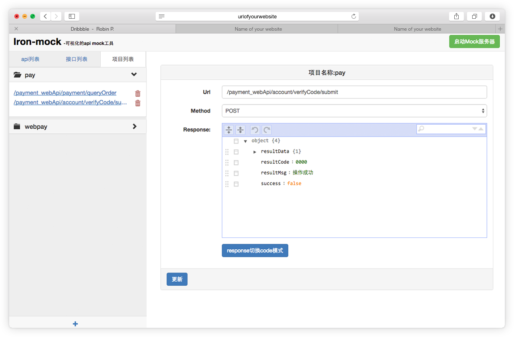
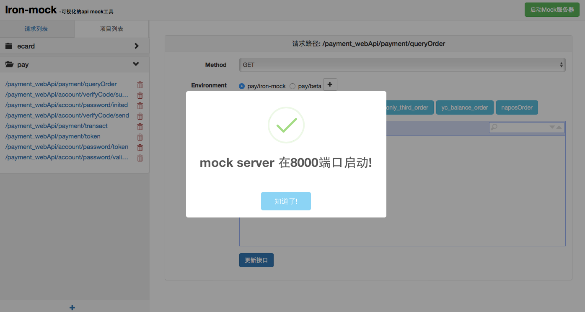
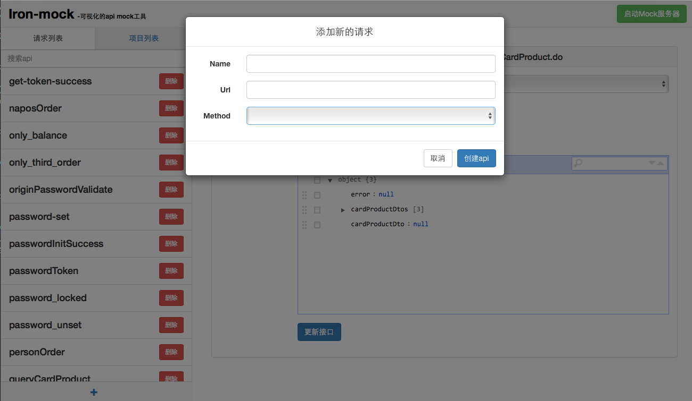
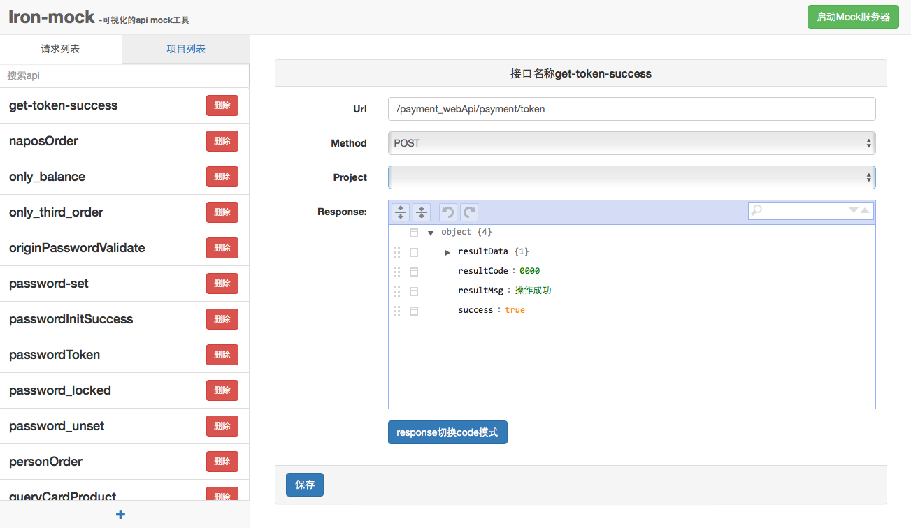
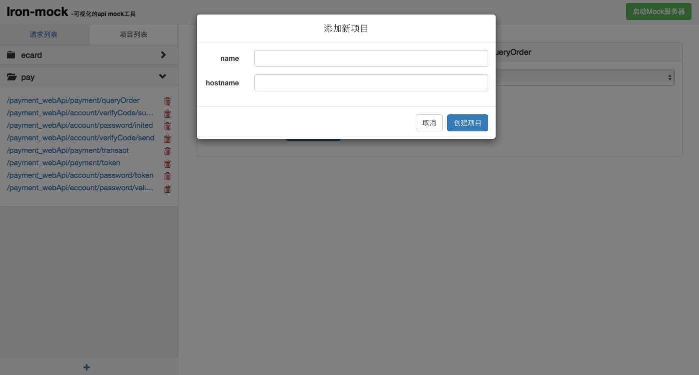
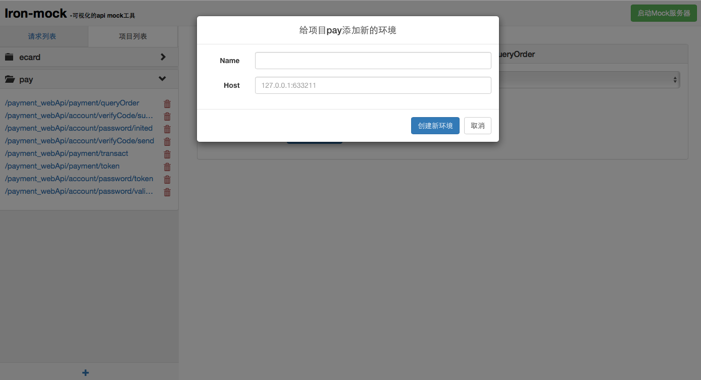
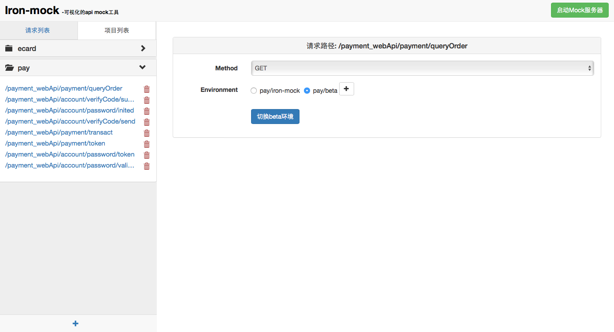
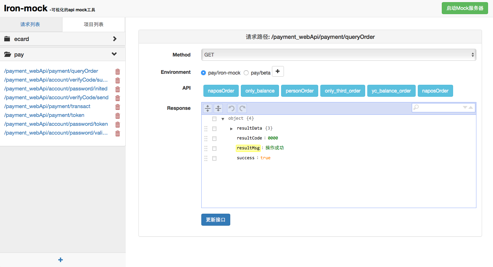

# Iron-mock

> 可视化的api mock工具，基于nodejs,依赖node >= 5.0.0环境。     




## 如何安装
从npm获取稳定安装包

```
$ sudo npm install -g iron-mock
```

## 使用方法

```
$ iron-mock server
```  

## 使用说明
Iron-mock设计的两个切入点分别是请求和项目。  

### 启动mock服务器

* 点击右上角的『启动Mock服务器』在8000端口启动一个监听进程。

 

### 请求列

> 存储所有添加好的api,这时候api还不能生效，api只有添加到具体项目才能生效。  

* 添加新的请求。

  


* 点击具体接口，可以编辑response返回和选择项目。  



### 项目列表

> 存储用户建立的所有项目，点开项目，展开该项目所有的url列表。

* 添加新的项目



* 点击具体项目的某一个url，切选『Environment』的选项可以切换这个url的调用环境。点击『+』按钮可以添加环境。

  



* 当『Environment』默认选中iron-mock选项时，可以在『API』选项切换具体返回的api实例和『response』编辑栏目中编辑response, 点击更新接口按钮生效。  

 
